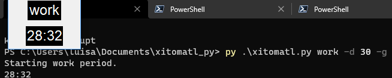

# xitomatl_py

## Main idea

Searching for the [pomodoro](https://en.wikipedia.org/wiki/Pomodoro_Technique) tracker closest to my ideal idea of it I realized that, maybe, I should make my own pomodoro tracker in order to archive a sensation of satisfaction and confort while using it. Whether this is a good idea or not I don't know, I suppose I will find out while I work on it.

Since I created this repository I have realized that a pomodoro app should be very simple. I was trying to develop a complex tool to make it more easy to apply pomodoro and it ended up beeing quite the opposite. So, from now on, I will focus on develop something easy to use with a code easy to understand.

---

## Guide

The only dependency is playsound, you can install it with:
> pip install playsound

How to start a new work period with a duration of 25 minutes:
> py xitomatl.py work -d 25  
> or  
> py xitomatl.py work -d 25 -g  

How to start a new rest period with a duration of 5 minutes:
> py xitomatl.py rest -d 25  
> or  
> py xitomatl.py rest -d 25 -g  

---

## Analysis

__What means pomodoro?__  
Tomato, it is the Italian word for tomato.

__What is that pomodoro technique about?__  
Working/Studying in specific time blocks.

__How are those blocks structured?__  
A work period followed by a short rest period repeated x times and a long rest period at the end.

__How long are each periods?__  
Work -> 25 minutes  
Short rest -> 3-6 minutes  
Long rest -> 15-30 minutes

__How long is a study session?__  
4 work periods + 3 short rests + 1 long rest

25x3 + (3-6)x3 + 15-30

75 + 9-18 + 15-30

75 + 9 + 15 = 99
75 + 18 + 30 = 122

99-122 minutes

---

## Why "Xitomatl"?

> Pomodoro -> Italian  
> Red tomato -> English  
> Jitomate -> Spanish  
> Xitomatl -> Nahuatl  

There is no particular reason, I don't know nahuatl neither I have special interest in people knowing this word. I used it just because it was the first thing that came to my mind after "pomodoro".

---

## Useful links

[PlaySound](https://www.geeksforgeeks.org/play-sound-in-python/)
[SimpleAudio](https://simpleaudio.readthedocs.io/en/latest/tutorial.html#waveobject-s)
[Sound in Python](https://realpython.com/playing-and-recording-sound-python/#simpleaudio)

---

## Ringtone credits

[marimba-do-re-mi-fa-so.wav](https://freesound.org/people/pogmothoin/sounds/401722/)
 downloaded from [freesound.org](https://freesound.org/)

credits to: [kickblue22](https://kickblue22.com//)

---
